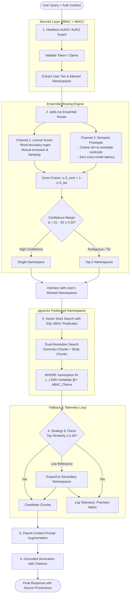

# Kitchome Enterprise Multi-Domain RAG

[](https://www.python.org/downloads/)
[](https://github.com/pgvector/pgvector)
[]()
[]()

**Kitchome RAG** is a domain-aware, enterprise-grade Retrieval-Augmented Generation system. Unlike traditional RAG implementations that execute similarity search across an unpartitioned monolithic vector database, Kitchome partitions knowledge into target **Index Namespaces** (`skills.ms`). 

It combines **two-channel ensemble routing**, **dual-resolution retrieval** (progressive document summaries + body chunks), **headless multi-tier authorization (RBAC + ABAC)**, and an automated **Strategy E evaluation telemetry loop**.

---

## 1. Combined Retrieval & Generation Architecture



---

## 2. High-Level Functional Specifications

### 2.1. Headless Authentication & Authorization (RBAC + ABAC)
Enforces multi-tier security at the vector database level (defense-in-depth), preventing unauthorized chunks from ever entering LLM memory:

* **RBAC Multi-Tier Access Matrix**:
  * **`free`**: Access to `recipes_culinary` and `general_home`.
  * **`premium`**: Adds `appliances_troubleshooting`, `cleaning_maintenance`, and `home_decor_design`.
  * **`scholar`**: Adds `academia_research` and scientific journals.
  * **`enterprise`**: All public namespaces plus **private tenant partitions** (`tenant_<id>_*`).
* **ABAC Database Predicates**:
  Dynamic SQL/JSONB predicates filter by `tenant_id`, `access_tier`, and `clearance_level`:
  ```sql
  WHERE namespace = ANY(:authorized_namespaces)
    AND (metadata->>'tenant_id' = :tenant_id OR metadata->>'tenant_id' = 'global')
    AND (metadata->>'access_tier' = ANY(:user_tier_levels))
    AND (CAST(metadata->>'clearance_level' AS INT) <= :clearance)
  ```

---

### 2.2. Two-Channel Ensemble Router (`skills.ms`)

The router eliminates the **"Fatal Routing Miss"** hazard (where a query is locked into the wrong namespace with zero recall) by combining deterministic lexical rules with lightweight semantic prototype classification:

```text
                            User Query
                                |
                                v
               +----------------------------------+
               | 1. High-Precision Lexical Rules  |  (Explicit tags, exact domain triggers)
               +----------------------------------+
                                | (Uncertain / Ambiguous)
                                v
               +----------------------------------+
               | 2. Semantic Prototype Router     |  (Lightweight Cosine Similarity against
               |    (Reuses existing Embedder)    |   domain exemplar embeddings; <5ms)
               +----------------------------------+
                                |
                     Confidence Margin Check
                     (Top 1 Score - Top 2 Score)
                               / \
                    High Margin   Low Margin / Tie
                        /             \
                       v               v
             Single-Namespace     Multi-Namespace Search
               Vector Search       (Top-2 namespaces with
                                    cross-reranking)
```

#### How It Works:
1. **Tier 1: High-Precision Lexical Rules ($S_{lex}$)**:
   * Evaluates exact domain triggers, file path patterns, and token-boundary regexes (`\b(recipe|cook|error|stain)\b`).
   * Applies mutual-exclusion damping (e.g., strong culinary verbs suppress appliance/cleaning scores by 80%) to prevent false triggers like *"clean the chicken"* from routing to cleaning.
2. **Tier 2: Semantic Prototype Router ($S_{sem}$)**:
   * When queries are synthetically complex, colloquial, or lack explicit keywords, the query is embedded once via `EmbeddingEngine`.
   * Computes cosine similarity against pre-computed centroid vectors of curated **Exemplar Utterances** for each domain ($<2\text{ ms}$ compute, zero external classifier models).
3. **Confidence Margin Check ($\Delta = S_1 - S_2$)**:
   * **High Margin ($\Delta \ge 0.20$)**: Clear domain winner $\rightarrow$ routes strictly to a **Single Namespace** to optimize latency and eliminate cross-domain noise.
   * **Low Margin / Ambiguity ($\Delta < 0.20$)**: Boundary ambiguity or multi-domain intent (e.g., *"How to clean air fryer basket without peeling coating"*) $\rightarrow$ triggers **Multi-Namespace Search** across Top-2 candidate namespaces, with downstream cross-reranking to guarantee zero recall loss.

---

### 2.3. Dual-Resolution Vector Storage
Every ingested document is indexed in two complementary resolutions:
* **Summary Chunk (`is_summary: true`)**: The progressive document summary (<1500 tokens). Responds directly to high-level, holistic questions (*"Summarize the safety rules for this appliance"*).
* **Body Chunks (`is_summary: false`)**: Detailed 700-token chunks. Responds to specific factoid inquiries (*"Error code E3 replacement part"*).
* **Parent-Context Injection**: When body chunks are retrieved, the parent document summary is injected as a header in the prompt, giving the LLM complete situational awareness.

---

### 2.4. Strategy E Fallback Loop & Telemetry
* **Relevance Guard**: If the top retrieved chunk similarity is below threshold $\gamma$ (e.g., $0.40$), the engine automatically broadens the search across adjacent namespaces.
* **Evaluation Telemetry**: Every query emits a `RetrievalTelemetry` event recording confidence margins, similarity scores, and fallback triggers:
  $$\text{Routing Precision} = 1 - \frac{\text{Fallback Events}}{\text{Total Queries}}$$
  This provides an automated audit trail to discover missing exemplars or out-of-domain knowledge gaps.

---

### 2.5. Decoupled Ingestion Service (Producer)
* Operates as an independent worker running **Progressive 700+150 Token Summarization**.
* Compresses raw blocks into concise summaries and purges verbosity upon reaching the buffer limit.
* Attaches security descriptors (`access_tier`, `tenant_id`) during indexing.
* **Registry Hygiene**: Keeps routing keywords in `skills_registry.json` clean and free from arbitrary document keyword contamination.

---

## 3. Project Structure

```text
Kitchome_rag/
├── config.py                   # Configuration and environment settings
├── project_details.md          # Comprehensive architectural specification
├── product_requirement.md      # Product requirement document & milestones
├── skills_registry.json        # Canonical domain definitions & curated exemplars
├── data/                       # Domain document storage (recipes, manuals, decor)
├── src/
│   ├── auth/                   # Headless AuthN / AuthZ Module
│   │   ├── context.py          # UserContext and UserTier models
│   │   ├── rbac.py             # RBAC tier-to-namespace mappings
│   │   └── abac.py             # ABAC policy evaluator & DB filter generator
│   ├── skills_ms/              # skills.ms Namespace & Routing Service
│   │   ├── registry.py         # Skill registry & exemplar loader
│   │   └── router.py           # Two-channel ensemble router (Lexical + Semantic)
│   ├── ingestion/              # Ingestion Service (Producer)
│   │   ├── loader.py           # Multi-format parser with security tagging
│   │   ├── chunker.py          # Text chunker (~700 tokens)
│   │   ├── summarizer.py       # Progressive 700+150 token summarizer
│   │   ├── embedder.py         # Dense feature projection engine (384-dim)
│   │   └── pipeline.py         # Decoupled ingestion worker
│   ├── vector_store/           # Storage Layer
│   │   ├── base.py             # In-memory partitioned vector store with ABAC
│   │   └── pgvector_store.py   # PostgreSQL pgvector implementation with JSONB ABAC
│   └── rag/                    # Guarded RAG Service & Query Tool
│       ├── engine.py           # Guarded RAG query orchestrator
│       ├── telemetry.py        # Strategy E evaluation telemetry logger
│       └── generator.py        # Grounded citation synthesizer
└── tests/
    ├── test_ingestion.py       # Ingestion & progressive summarization tests
    ├── test_ensemble_router.py # Lexical, semantic prototype & margin tests
    ├── test_auth_rbac_abac.py  # User tier & tenant isolation tests
    └── test_rag_engine.py      # End-to-end RAG, Strategy E fallback & telemetry tests
```

---

## 4. Quickstart & Verification

### Running the Test Suite
```bash
pytest tests/ -v
```

### Example Usage (Headless Guarded RAG Tool)

```python
from src.auth.context import UserContext, UserTier
from src.rag.engine import RAGQueryEngine

# Initialize the guarded query engine
rag_tool = RAGQueryEngine()

# Example: Scholar tier querying academic or appliance knowledge
user = UserContext(
    user_id="usr_101",
    tier=UserTier.SCHOLAR,
    tenant_id="global",
    clearance_level=2
)

response = rag_tool.query(
    query_text="How do I clean and prep salmon for pan searing?",
    user_context=user
)

print("Target Namespaces:", response["resolved_namespaces"])
print("Routing Margin:", response["confidence_margin"])
print("Answer:", response["answer"])
print("Citations:", response["citations"])
```
